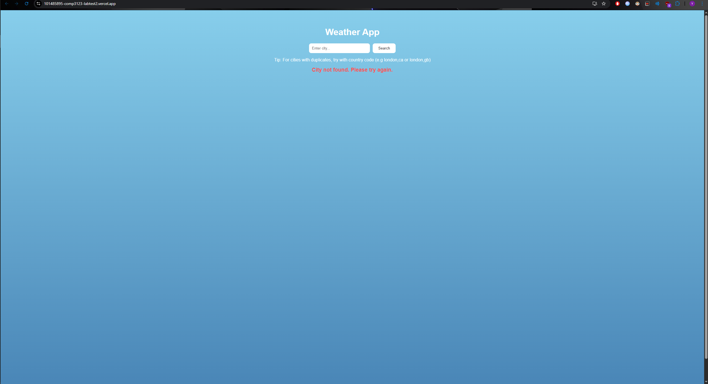
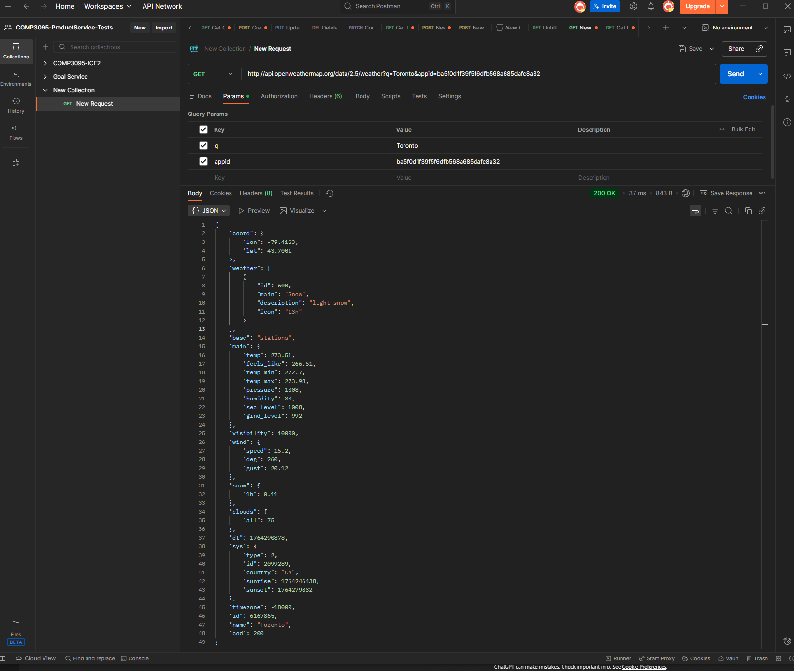

# Getting Started with Create React App

This project was bootstrapped with [Create React App](https://github.com/facebook/create-react-app).

# Laurence Liang - 101485895
Started project with npx create-react-app 101485895_comp3123_labtest2,
then ran npm install for dependencies, and ran the app through npm start

After which, I created my account on openweathermap to get my api key,
but the api key took like 10 minutes to actually activate after verifying email.
This did have me worrying a tiny bit as I began around 6:10 pm and was worried the
API key wouldn't be activated in time.

So I started working on the actual code itself, while periodically checking postman.
I started with the basic components that would actually be used on the website, 
the weathercard which has the actual weather data and the searchbar to be able to search for other cities, both of which were simple. 

Afterwards, I started on the main app.js, which has the main fetchWeather function that takes city name input from user and displays the weather for it.
Started by just having the search bar and weathercard working, 
then added error handling when searching for cities that don't exist.
Afterwards, added country code next to city name for clarity,
and lastly added more weather data to the weathercard.

